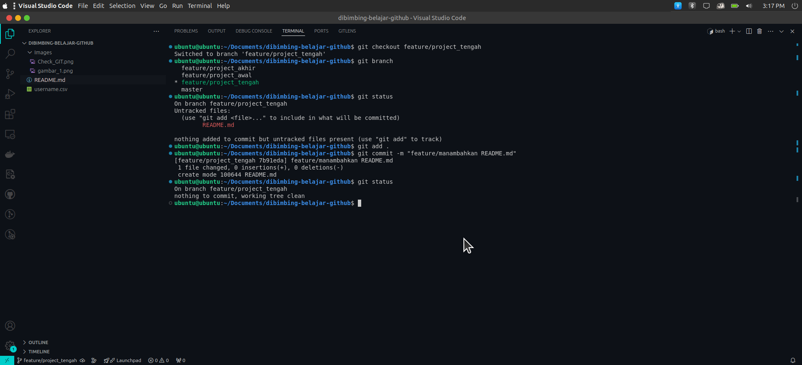

# Panduan Menggunakan Git

Panduan ini menjelaskan langkah-langkah dasar untuk menggunakan Git, mulai dari instalasi, inisialisasi repositori, hingga melakukan commit dan push ke repository remote seperti GitHub.

## Prasyarat

- Pastikan Git sudah terinstal di komputer. Anda bisa memeriksa dengan menjalankan perintah:


## Konfigurasi Git

- Setelah Git terinstal, lakukan konfigurasi awal untuk menetapkan nama pengguna dan email yang akan tercatat di setiap commit:
 
  ```bash
  git config --global user.name "Nama Anda"
  git config --global user.email "email@contoh.com"
  ```

## Tahapan-Tahapan menggunakan Git

1. Buat direktori baru untuk proyek Anda, atau buka direktori proyek yang sudah ada:

   ```bash
    mkdir dibimbing-belajar-github
    cd dibimbing-belajar-github
    ```

2. Inisialisasi repositori Git di direktori tersebut :


3. Melakukan git add untuk memasukan file ke repository git local :


4. Membuat beberapa branch untuk proses lebih lanjut, untuk penamaan branch ya sebagi berikut :

- feature/project_awal
- feature/project_tengah
- feature/project_akhir


6.  Pindah ke branch feature/project_awal lalu lakukan proses sebegai berikut :


7. Selanjutnya, Pindah ke branch feature/project_tengah lalu lakukan proses sebegai berikut :



8. Selanjutnya, Pindah ke branch feature/project_akhir lalu lakukan proses sebegai berikut :


9. Setelah itu balik lagi ke branch master lalu ubah namanya ke main :


10. Lakukan merge pada setiap branch ke branch utama (main) :


11. Adapun gambaran dalam bentuk graph atau struktur git local dan melihat semua riwayat commit :

- Diagram git local melalui terminal
 

- Diagram git local melalui Gitlens 


12. setelah melakukan merge, selanjutnya membuat repository di cloud atau di github :


13. Lakukan git remote untuk terkoneksikan dengan local ke cloud (github) dan push untuk mengirim ke github :


 14. Tampilan file sudah masuk ke repository github :


 15. Setelah dimasukan ke repository github lalu ada perubahan pada README.md dan penambahan gambar :

 

16. Setelah melakukan perubahan, kemudian lakukan push lagi dengan branch yang berbeda untuk melakukan pull. disini saya menamakan feature/add_and_edit :

- setelah berhasil di push, selanjutnya klik url yang ada pada hasil output ya :
 

 17. Setelah klik url ya akan diarahkan ke repository github yang akan melakukan pull :

- klik compore & pull request
 

 18. Selanjutnya silakan check kembali perubahan yang dilakukan dan setelah bisa lanjut jika sudah pasti perubahannya :

- Menambahkan gambar
 

- Edit README.md
 

- Silakan klik create pull request (jika sudah yakin ingin dirubah)
 

- Terakhir klik merge pull request dan klik continue pull
 

 19. Setelah berhasil di klik dan tidak terjadi conflict maka perubahan berhasil

 20. Jika, ingin mengambil data dari github atau menyalinnya ke local. Jalankan perintah ini di terminal atau cmd :

    ```bash
    git clone https://github.com/Ajied21/dibimbing-belajar-github.git
    ```

   *untuk url bisa disesuaikan pada repository yang akan di clone

 ## README.md ini mencakup langkah-langkah dasar untuk menggunakan Git dari instalasi hingga manajemen branch dan push ke repository remote. Anda dapat menyesuaikannya lebih lanjut sesuai kebutuhan spesifik.
 
